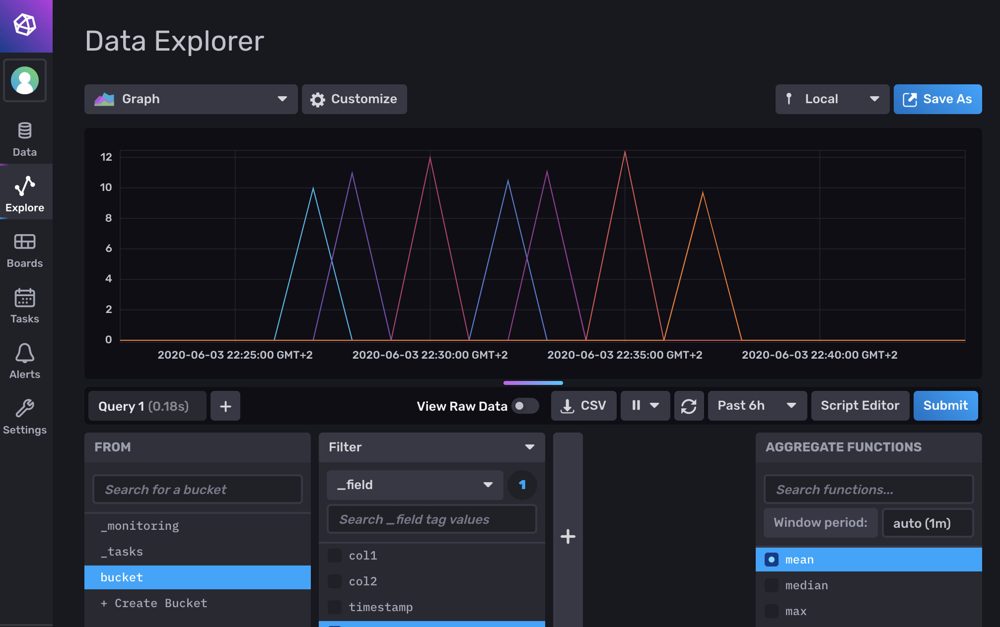

# fieldtest-collector

**THIS SERVER COMPONENT IS ONLY INTENDED FOR LAB ENVIRONMENTS.**

This repository contains a server configuration, that can process HTTP POSTs with CSV sensor data and store it in an InfluxDB database:

```
ito-fieldtest (App) --> fieldtest-collector (Telegraf) --> InfluxDB
```

It is based on [Telegraf](https://www.influxdata.com/time-series-platform/telegraf/) using the following configuration:

- `inputs.http_listener_v2` with `data_format = "csv"` to parse HTTP POSTs with CSV payload data
- `outputs.influxdb_v2` for writing data to InfluxDB v2
- `outputs.file` with `files = ["stdout"]` for writing parsed data to stdout for debugging

The repository contains a `docker-compose.yml` for locally running the configured telegraf server as well as an InfluxDB2 system. Alternatively, the docker image containing the server can be deployed to a cloud service and configured to use an external InfluxDB instance (like the [InfluxDB Cloud](https://www.influxdata.com/products/influxdb-cloud/)).

# Getting started

Create a `.env` file and assign environment variables:

```sh
cp .env.example .env
```

The first time running InfluxDB, access needs to be configured using [`influx setup`](https://v2.docs.influxdata.com/v2.0/reference/cli/influx/setup/):

```sh
docker-compose up
docker-compose exec influxdb bash -c 'influx setup -b $INFLUXDB_BUCKET -f -o $INFLUXDB_ORGANIZATION -p $INFLUXDB_PASSWORD -r $INFLUXDB_RETENTION -u $INFLUXDB_USERNAME && influx auth list'
```

This will issue an access token, which is displayed using the `influx auth list` command. Copy and assign it to `INFLUXDB_TOKEN` in `.env` and restart everything, so that Telegraf can use it:

```sh
docker-compose down
docker-compose up
```

Telegraf should now be able to send data to InfluxDB. The InfluxDB UI can be accessed at http://localhost:9999.

InfluxDB will persist its data in `influxdb/data`. It can be cleaned with `rm -rf influxdb/data`. After that, the setup process needs to be done again.

# Ingesting data

This will send an HTTP POST to telegraf with some payload CSV data. The first CSV line is expected to contain the column names:

```sh
curl -XPOST --header 'Content-Type: text/csv' http://localhost:8080/telegraf -d 'col1,col2,timestamp,value
"hello","101",1591216016,"10.0"
"world","102",1591216076,"11.0"
"world","103",1591216176,"12.0"
"world","104",1591216276,"10.5"
"world","105",1591216376,"11.1"
"world","106",1591216476,"12.4"
"world","107",1591216576,"9.7"'
```

The data will be stored in InfluxDB. It can be queried using the InfluxDB UI:


